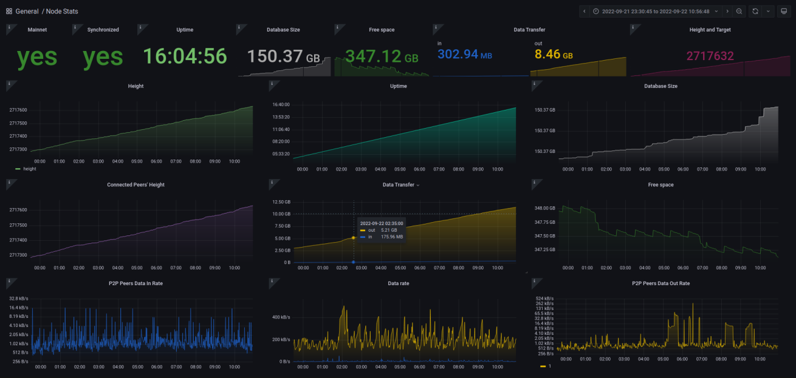
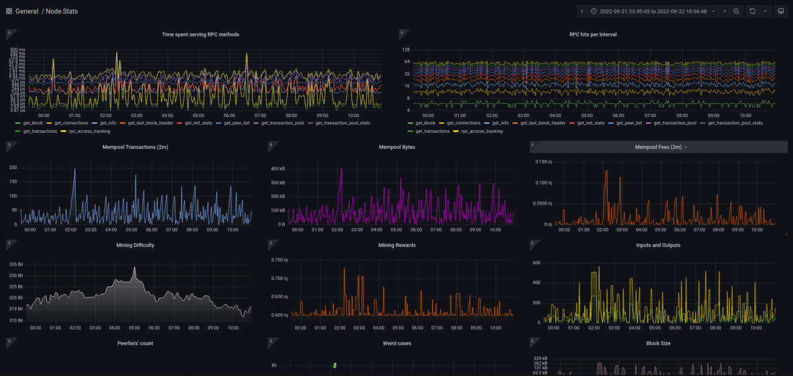

# docker-monero-node

Simple way to run a Monero node with some basic monitoring tools packaged in.

Leverages [Prometheus](https://prometheus.io/docs/introduction/overview/), [Grafana](https://grafana.com/), and [monero-exporter](https://github.com/cirocosta/monero-exporter) on top of `monerod`.

## Setup

The only requirements are [Docker](https://docs.docker.com/get-docker/) and [Docker Compose](https://docs.docker.com/compose/install/). Ensure those are installed on your system. There's an optional `Makefile` provided if you'd like to use that, just ensure `make` is installed. Type `make help` for more information about the make options.

```
# Clone and enter the repository
git clone https://github.com/lalanza808/docker-monero-node
cd docker-monero-node

# OPTIONAL: Setup Grafana password, blockchain storage location, or port and container image tag overrides
cp env-example .env
vim .env

# Build containers
docker-compose build  # make build
```

The following ports will be bound for `monerod` by default, but you can override in `.env`:
- 18080   # p2p
- 18081   # restricted rpc
- 18082   # zmq
- 18083   # unrestricted rpc

The following ports will be bound for other services:
- 9090  # prometheus web ui
- 3000  # grafana web ui
- 9000  # exporter web api (/metrics)

You will want to open/allow ports 18080 and 18081 in your firewall for usage as a remote/public node (or whichever p2p and restricted ports you picked).

Also, you may want to setup a reverse proxy to Grafana if you would like to expose the visualizations for the world to see. Be sure to lock down the administrative settings or leave login disabled!

## Usage

It's fairly simple, use `docker-compose` to bring the containers up and down and look at logs.

```
# Run containers
docker-compose up -d            # make up

# Check all logs
docker-compose logs -f  

# Check monerod logs
docker-compose logs -f monerod  # make logs
```

Navigate to http://localhost:3000 and log into Grafana. Find the `Node Stats` dashboard to get those sweet, sweet graphs.

If you've installed this on another system you will want to use [SSH tunnels](https://www.ssh.com/ssh/tunneling/example) (local forwarding) to reach Grafana (if not exposing via reverse proxy):

```
ssh <VPS OR SERVER IP> -L 3000:localhost:3000
```

Then navigate to http://localhost:3000. Here is what the graph looks like:




